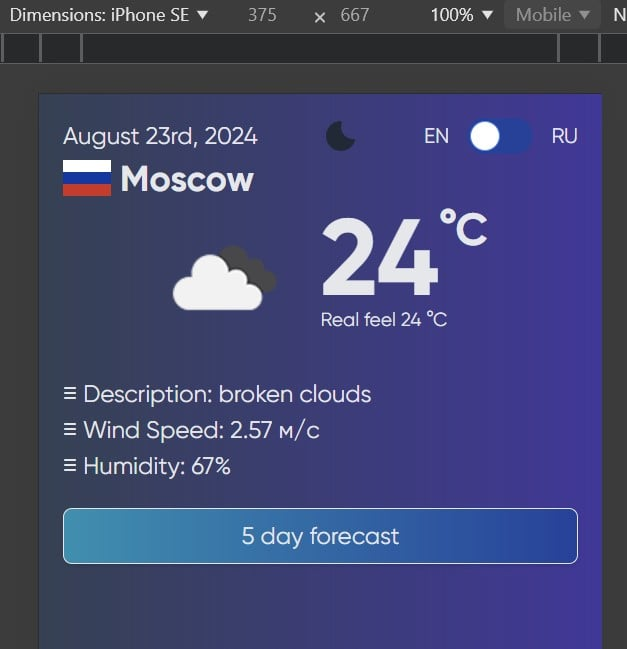

# Weather Forecast Application 🌤️

This project is a Vue 3 application that provides weather forecasts using the OpenWeatherMap API. The application supports both light and dark themes and allows the user to toggle between them. The weather data is dynamically fetched based on the user's location, which is determined via the browser's geolocation API.

## Features

- 🌍 **Geolocation-Based Weather**: Automatically fetches weather data based on the user's location.
- 🌐 **Multi-Language Support**: Displays weather information in Russian or English depending on the user's locale.
- 🌙 **Dark Mode**: Toggle between light and dark themes using a stylish Flowbite-based switch.
- 🏙 **City-Based Weather Data**: Allows users to see weather data specific to their city.
- 🔄 **Reactive Updates**: Weather data is automatically refreshed when the user's city or language preference changes.

## Installation

1. Clone the repository:

   ```bash
   git clone https://github.com/Civility/weather

   ```

2. Navigate to the project directory:

   ```bash
   cd weather

   ```

3. Navigate to the project directory:

   ```bash
   npm install

   ```

4. Set up your environment variables (API keys, etc.) in a .env file.

## Usage

1. Start the development server (vite --port 8080"):

   ```bash
   npm run dev

   ```

2. Open your browser and navigate to http://localhost:8080.

## Components

- Main Store: Manages the global state of the application, including locale, theme, and city data.
- Weather Store: Handles fetching and storing weather data from the OpenWeatherMap API.
- Theme Toggle: A Flowbite-based toggle switch for light and dark modes.



## License

This project is licensed under the Modified MIT License.

Terms and Conditions
Free Use: This software is free to use, modify, and distribute for both personal and commercial purposes, provided that the following conditions are met.

Attribution: You must include proper attribution to the original author in all copies or substantial portions of the software. The attribution should include the author's name and a link to the original repository.

Permission Requirement: While you are free to use, modify, and distribute the software, explicit written permission from the original author is required for the following cases:

Redistribution of the software as part of a paid product or service.
Usage of the software in projects intended for commercial sale or distribution.
Any form of use where the software is a key component of a commercial service or product.
Warranty Disclaimer: The software is provided "as is", without warranty of any kind, express or implied, including but not limited to the warranties of merchantability, fitness for a particular purpose, and non-infringement. In no event shall the authors or copyright holders be liable for any claim, damages, or other liability, whether in an action of contract, tort, or otherwise, arising from, out of, or in connection with the software or the use or other dealings in the software.

Modification of License: The author reserves the right to change the terms of the license at any time, with prior notice to users. Any changes will be reflected in the LICENSE file within the repository.

How to Request Permission
If you wish to use the software in a way that requires permission, please contact the author at "civilitys@gmail.com" with details of your intended use. Include the following information:

Your name and organization (if applicable).
A detailed description of how you plan to use the software.
Any modifications you intend to make to the software.
The nature of the product or service in which the software will be used.
